# Defence GIS Tracking System

```
================================================================================
                    DEFENCE ASSET TRACKING & GEOFENCING SYSTEM
     Real-Time Telemetry Tracking • Perimeter Geofencing • Spatial Intelligence
            Java • PostgreSQL • PostGIS • Apache Tomcat • Leaflet.js
================================================================================
```

[](https://github.com/Mahendra7073/Defence-Asset-Tracking-Geofencing-System/actions)
[](https://adoptium.net/temurin/releases/?version=17)
[](https://www.postgresql.org/)
[](https://postgis.net/)
[](https://tomcat.apache.org/)
[](LICENSE)

A production-grade, real-time spatial asset monitoring, alert generation, and geofencing management application designed for defence sector logistics and perimeter security. Built with PostgreSQL + PostGIS, Java Servlets, Apache Tomcat, and Leaflet.js maps.

---

## 📖 Navigation Index
* [Architecture Documentation](docs/ARCHITECTURE.md)
* [REST API Documentation](docs/API_DOCUMENTATION.md)
* [Database Schema Reference](docs/DATABASE.md)
* [Installation Guide](INSTALLATION.md)
* [Tomcat Deployment Guide](DEPLOYMENT.md)
* [Security Controls Policy](SECURITY.md)
* [Troubleshooting Guide](TROUBLESHOOTING.md)
* [Contributing Guidelines](CONTRIBUTING.md)
* [Folder Tree Map](PROJECT_STRUCTURE.md)

---

## ⚡ Overview
The Defence GIS Tracking System provides military command centers with spatial intelligence. By combining high-frequency coordinate ingestion with database-level geometric computations, the system processes fleet tracking parameters, alerts operators on perimeter breaches, and renders real-time Leaflet overlays without heavy framework dependency.

---

## ⚙️ Features
- **Live Fleet Tracking:** Real-time updates of military vehicles, personnel, and drones on a Leaflet map.
- **Dynamic Geofencing:** Restricted, warning, and safe polygon boundary calculations using PostGIS topological formulas.
- **Micro-Animations:** Interactive map highlights that pulse geofence perimeters and fade unselected zones.
- **Historical Route Playback:** Displays breadcrumb path logs and calculates distance measurements and speeds.
- **KPI Dashboards:** KPI panels, warning counters, and charts showing active hardware parameters.
- **Authorization Filters:** Session validation filters guarding all endpoints under `/api/*`.

---

## 🖼️ Application Interfaces (Screenshots)

Below are the actual interface screenshots captured from the running system:

### 1. Landing Page
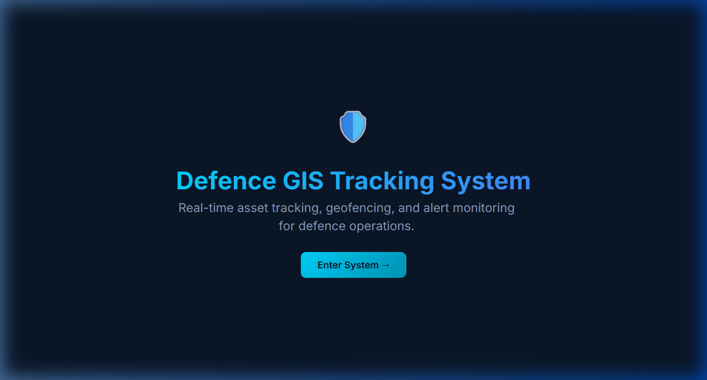

### 2. Secure Login Portal
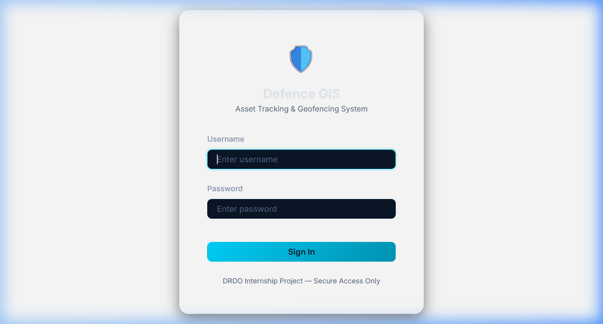

### 3. Operational Metrics Dashboard
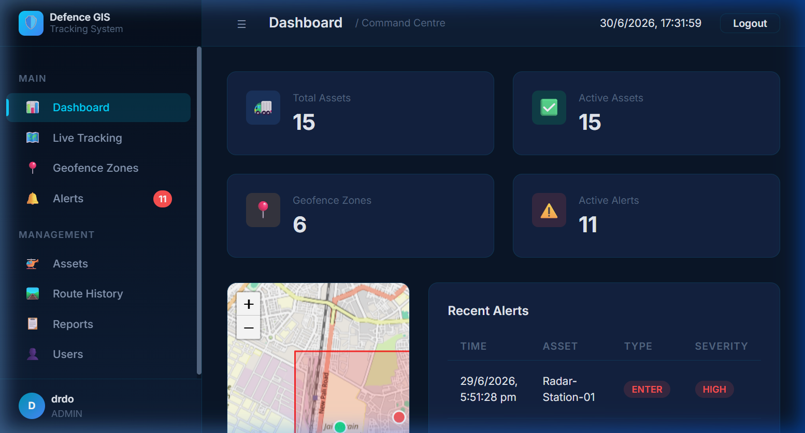

### 4. Real-Time Telemetry Map
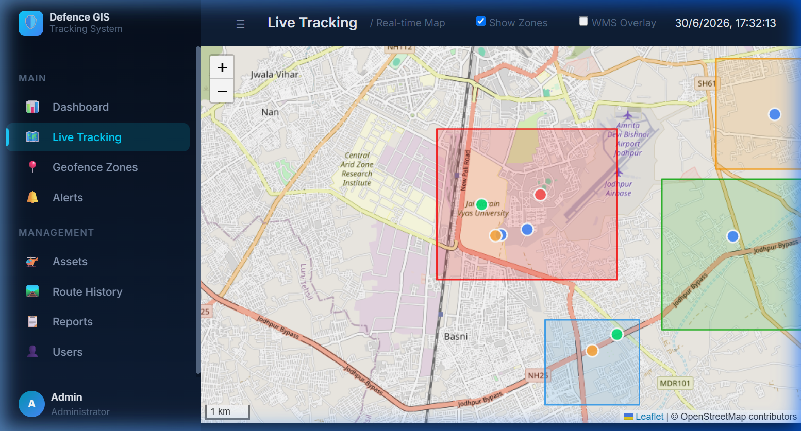

### 5. Perimeter Geofence Zones Map
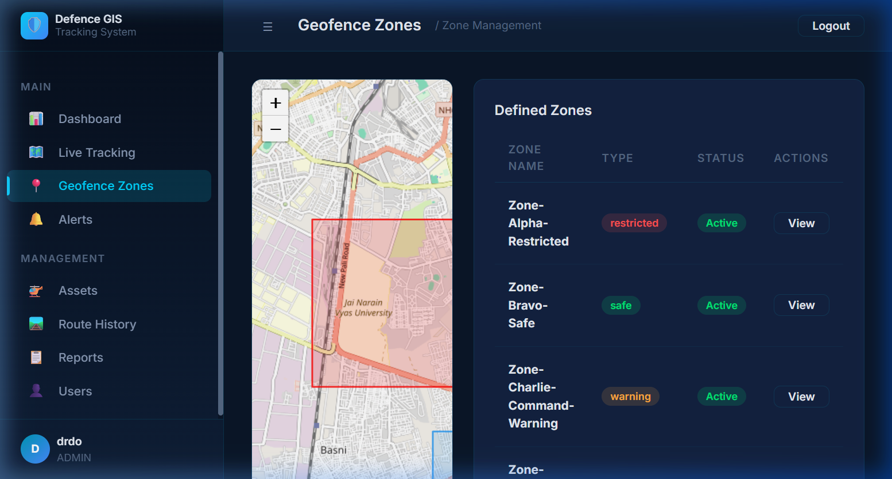

### 6. Geofence Zone Metrics (Breach Inspection)
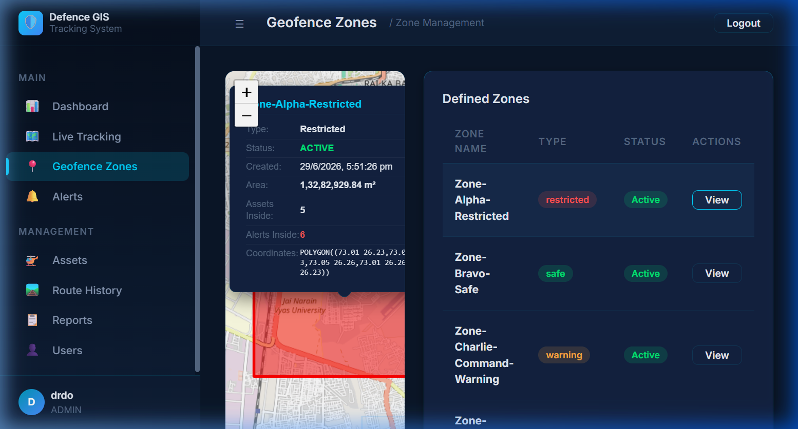

### 7. Core Assets Registry
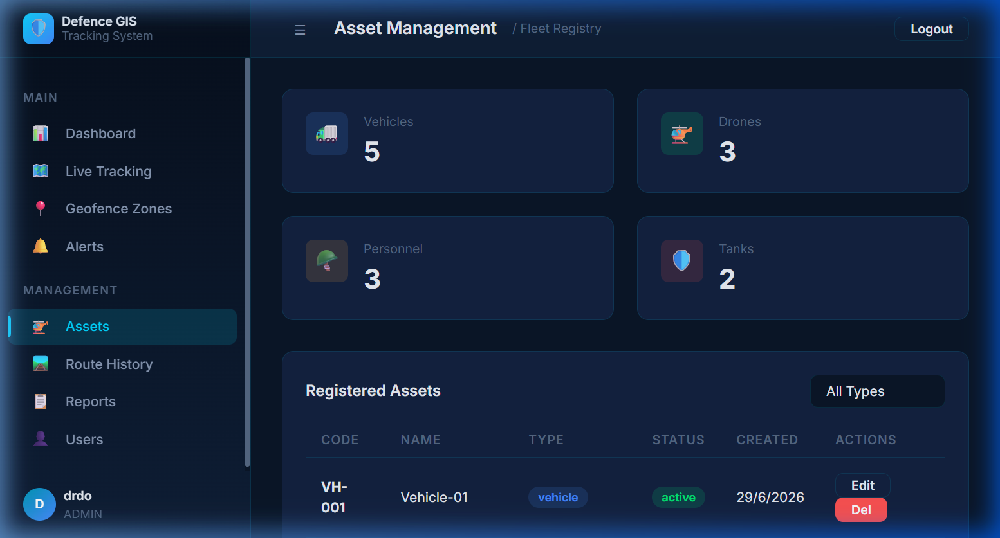

### 8. Real-Time Breach Alerts Feeds
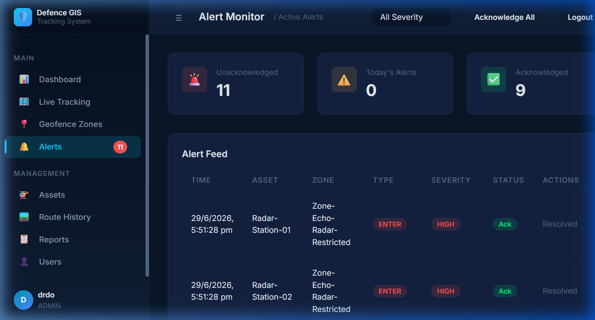

### 9. Custom Query Reports Generator
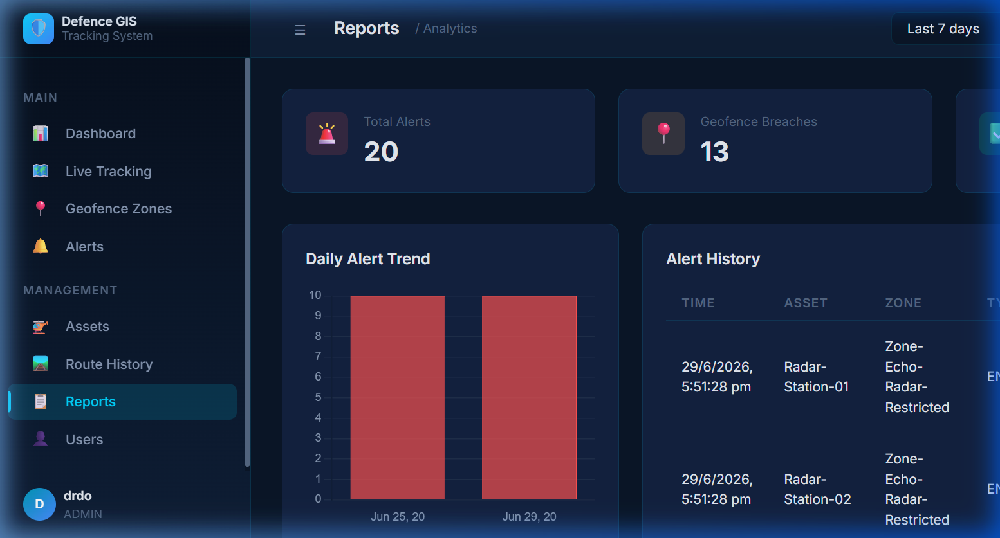

### 10. System Administrator Accounts Manager
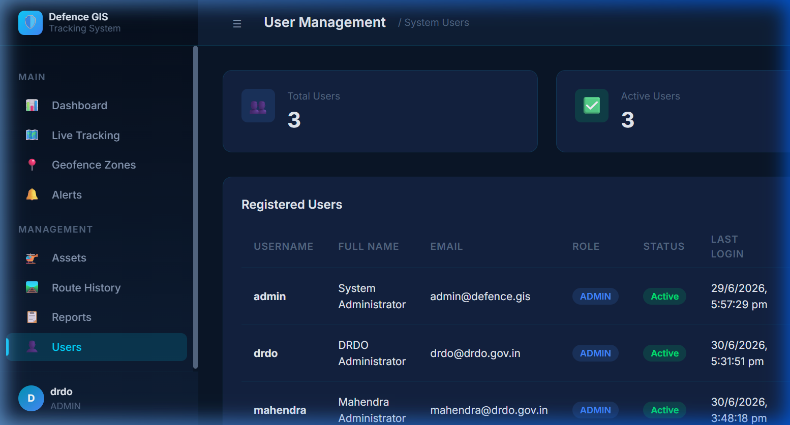

### 11. Historical Route Replay Player
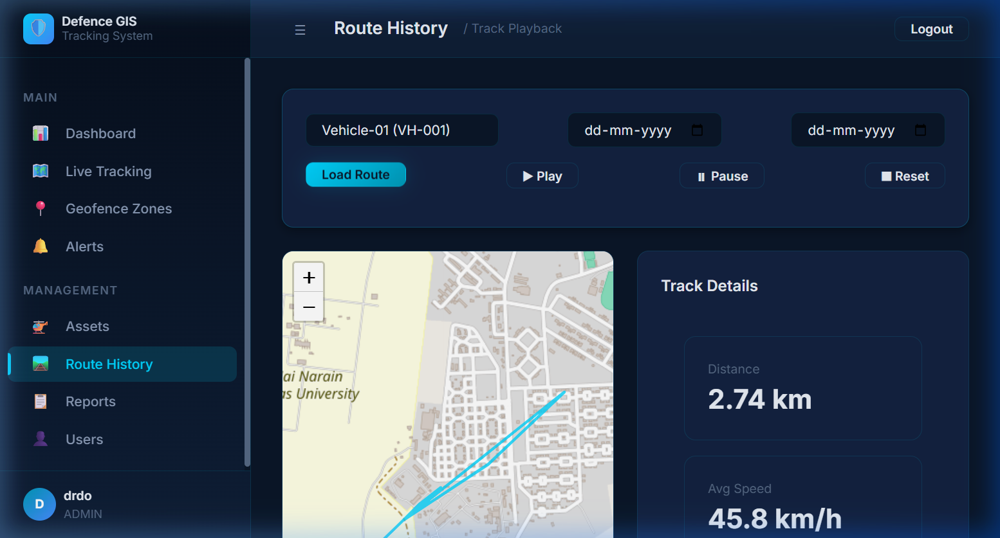

### 12. Mobile Responsive Dashboard Emulation
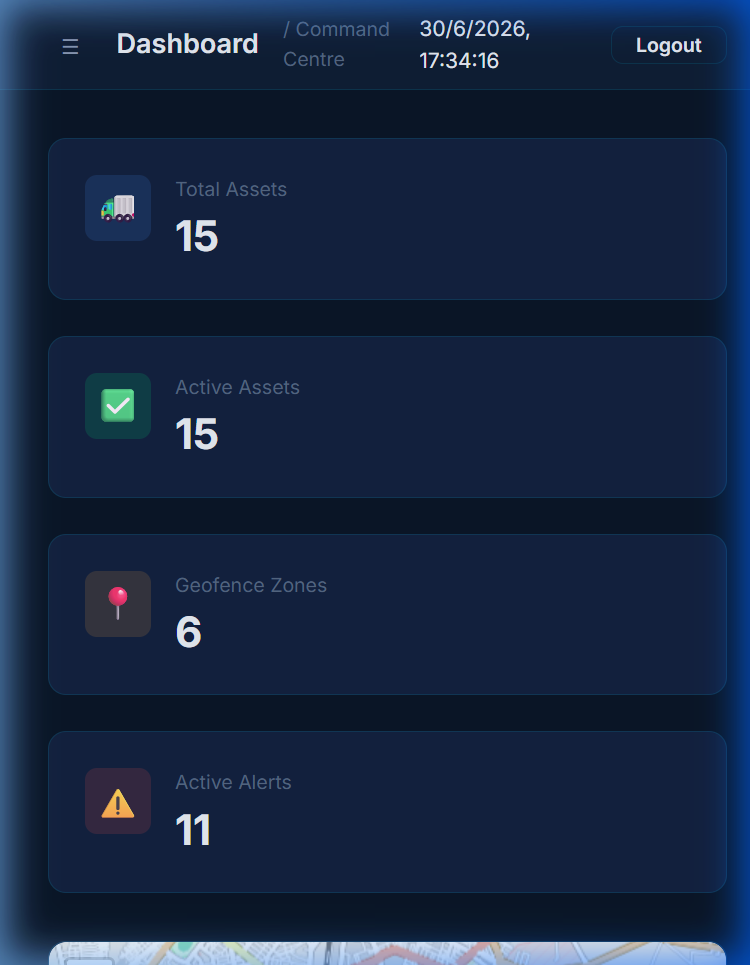

---

## 🏗️ System Architecture
The application uses a clean multi-tier structure to decouple map presentation from database queries:

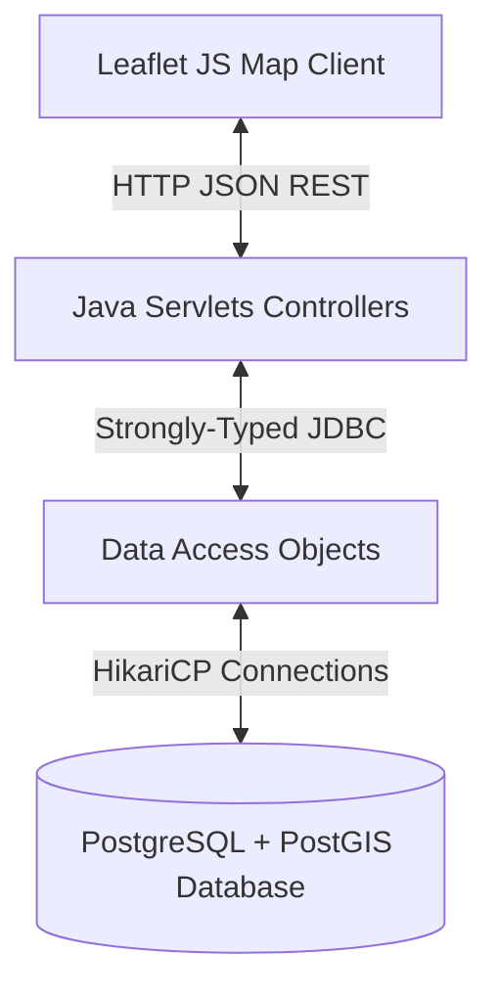

For complete sequence diagrams, context maps, and flows, see [docs/ARCHITECTURE.md](docs/ARCHITECTURE.md).

---

## 🛠️ Technology Stack

| Component | Technology | Description |
| --- | --- | --- |
| **Frontend** | HTML5, Vanilla CSS, Vanilla JS | Dark-themed, lightweight SPA client. |
| **Mapping Engine** | Leaflet.js | GIS maps overlay rendering layer. |
| **Backend API** | Java 17, Java Servlets, Maven | API endpoint processing. |
| **Connection Pool**| HikariCP | High-performance JDBC connection management. |
| **Serialization** | Google Gson | JSON parsing and serialization utility. |
| **Authentication** | BCrypt | Constant-time password verification hashing. |
| **Database** | PostgreSQL 15+ & PostGIS 3+ | Spatial geometry storage and topological checks. |

---

## 📥 Installation Summary
Prerequisites include JDK 17, Maven 3.8+, Tomcat 9.0+, and PostgreSQL with PostGIS.

1. **Clone the project:**
   ```bash
   git clone https://github.com/Mahendra7073/Defence-Asset-Tracking-Geofencing-System.git
   ```
2. **Database Setup:** Run migrations sequentially:
   ```bash
   psql -U postgres -f database/defence_gis.sql
   psql -U postgres -d defence_gis -f database/migrations/V002__schema_fixes_and_geofencing.sql
   # (Run V003, V004, V005 migrations in order)
   ```
3. **Configurations:** Add database connection settings to `backend/src/main/resources/db.properties`.
4. **Compile & Deploy:**
   ```bash
   cd backend
   mvn clean package
   copy target/DefenceGIS.war %CATALINA_HOME%/webapps/
   ```

*For detailed configurations, see [INSTALLATION.md](INSTALLATION.md) and [DEPLOYMENT.md](DEPLOYMENT.md).*

---

## 🐳 Docker Deployment (Recommended)

Deploy the entire system with a single command — no manual installation of Java, Tomcat, PostgreSQL, PostGIS, or GeoServer required.

### Prerequisites
- [Docker Desktop](https://www.docker.com/products/docker-desktop/) installed and running (Windows/Linux/macOS)
- Git

### Quick Start
```bash
# 1. Clone the repository
git clone https://github.com/Mahendra7073/Defence-Asset-Tracking-Geofencing-System.git
cd Defence-Asset-Tracking-Geofencing-System

# 2. Build and start all containers
docker compose up -d --build

# 3. Wait for initialization (~2-3 minutes on first run)
docker compose ps     # Check all containers are "healthy"

# 4. Open browser
# Application:  http://localhost:8080/DefenceGIS
# GeoServer:    http://localhost:8085/geoserver
```

### Docker Commands
| Command | Description |
|---|---|
| `docker compose up -d --build` | Build and start all services |
| `docker compose up -d` | Start services (after initial build) |
| `docker compose down` | Stop and remove containers |
| `docker compose restart` | Restart all services |
| `docker compose logs -f` | Follow live logs |
| `docker compose logs -f tomcat` | Follow Tomcat logs only |
| `docker compose ps` | Check container status |
| `docker compose down -v` | Stop and remove containers + volumes (full reset) |

### Container Architecture
| Container | Image | Port | Purpose |
|---|---|---|---|
| `defence-postgres` | `postgis/postgis:16-3.4` | `5432` | PostgreSQL + PostGIS database |
| `defence-tomcat` | Multi-stage build | `8080` | Java 17 + Tomcat 9 + WAR |
| `defence-geoserver` | `kartoza/geoserver:2.25.2` | `8085` | GeoServer WMS/WFS service |

### GeoServer Configuration
After containers are healthy, run the GeoServer setup script once:
```bash
# Linux/macOS/WSL
bash docker/geoserver/setup_geoserver.sh

# Windows (Git Bash or WSL)
bash docker/geoserver/setup_geoserver.sh
```

### Environment Variables
Docker configuration values are stored in `.env`:
```properties
POSTGRES_DB=defence_gis
POSTGRES_USER=postgres
POSTGRES_PASSWORD=postgres
GEOSERVER_ADMIN_USER=admin
GEOSERVER_ADMIN_PASSWORD=geoserver
```


## 🔐 Default Credentials

Pre-seeded database accounts:

| Username | Password | Role | Description |
| --- | --- | --- | --- |
| **drdo** | `drdo2026` | ADMIN | Primary Administrator |
| **admin** | `admin123` | ADMIN | System Administrator |
| **mahendra** | `mahendra123` | ADMIN | Operations Administrator |

---

## 🚀 Future Scope
- **Websockets Stream:** Replace long-polling routes with full-duplex WebSocket connections.
- **Kafka Telemetry Buffer:** Integrate Kafka message streams to ingestion pipelines for high-throughput tracking.
- **Audit Logs:** Add database-level log tables for administrative monitoring.

---

## 🤝 Contributing
For commit rules, branch names, and PR procedures, please read the [CONTRIBUTING.md](CONTRIBUTING.md) guide.

---

## 📄 License
Licensed under the [MIT License](LICENSE).

---

## 👥 DRDO Internship Team

This project was developed as part of the DRDO Internship Program by a collaborative student team.

### 3rd Year Students

- **Mahendra Gurjar** — Computer Science & Engineering (CSE)
- **Priyadarshini Choudhary** — Information Technology (IT)
- **Shahina Parvin** — Computer Science & Engineering (CSE)

### 2nd Year Students

- **Gaurav Deora** — Computer Science & Engineering (CSE)
- **Omprakash** — Computer Science & Engineering (CSE)
- **Chandrika Solanki** — Information Technology (IT)
- **Abhimanyu Singh Rajpurohit** — Information Technology (IT)
- **Pinku Daila** — Artificial Intelligence & Data Science (AIDS)
- **Kulwant Singh Rathore** — Electronics & Communication Engineering (ECC)

**Total Team Members:** 9

### Internship Mentor

**Shri Shyam Lal**


## Acknowledgements

This project was successfully completed as part of the **DRDO Internship Program**.

We sincerely thank the **Defence Research and Development Organisation (DRDO)** for providing this valuable learning opportunity and an environment to work on real-world GIS-based defence applications.

Our heartfelt appreciation goes to our **Internship Mentor, Shri Shyam Lal**, whose guidance, encouragement, and technical insights were instrumental throughout the project.

We also acknowledge the maintainers and contributors of the open-source technologies that made this project possible, including **Java**, **Leaflet.js**, **PostgreSQL**, **PostGIS**, **GeoServer**, **Apache Tomcat**, and **Maven**.

