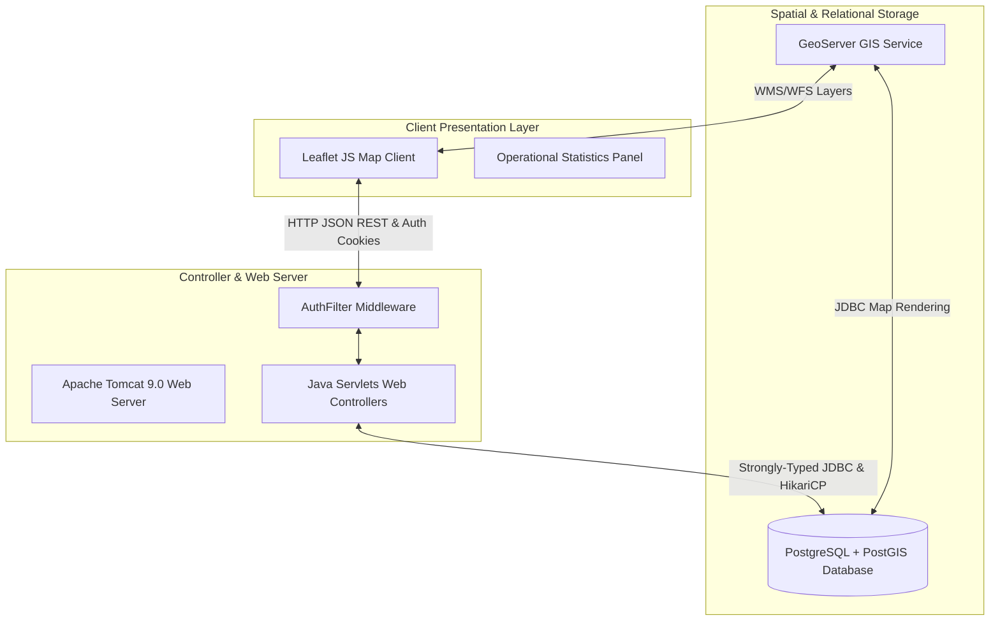

# 🛡️ Defence Asset Tracking & Geofencing System

### Real-Time Fleet Telemetry • Spatial Intelligence • Perimeter Security & Alerting
*Built for DRDO GIS Operations using Java Servlets, PostgreSQL/PostGIS, GeoServer, and Leaflet.js.*

---

## 📖 Table of Contents
1. [Project Overview](#-project-overview)
2. [Key Features](#-key-features)
3. [System Architecture](#-system-architecture)
4. [Tech Stack](#-tech-stack)
5. [Project Structure](#-project-structure)
6. [Application Screenshots](#-application-screenshots)
7. [Installation & Setup](#-installation--setup)
   - [Windows & Linux Native Setup](#windows--linux-native-setup)
   - [Docker & WSL2 Deployment Guide](#docker--wsl2-deployment-guide)
8. [Setup Commands & Workflows](#-setup-commands--workflows)
9. [Developer Guide](#-developer-guide)
   - [Database Schema Reference](#database-schema-reference)
   - [REST API Reference](#rest-api-reference)
   - [GIS Layer Flow (Spatial Data Pipeline)](#gis-layer-flow-spatial-data-pipeline)
   - [Real-Time Simulation & Alert Engines](#real-time-simulation--alert-engines)
10. [Troubleshooting & Common Errors](#-troubleshooting--common-errors)
11. [Production Deployment Guide](#-production-deployment-guide)
12. [Security, Performance & Code Standards](#-security-performance--code-standards)
13. [Future Improvements](#-future-improvements)
14. [License & Contributing](#-license--contributing)

---

## ⚡ Project Overview
The **Defence Asset Tracking & Geofencing System** is a mission-critical, production-grade spatial intelligence platform designed for securing military bases, monitoring troop movements, and geofencing sensitive defence perimeters (e.g., ammo depots, restricted airfields, and safe sectors). 

By combining high-frequency GPS telemetry ingestion with database-level geometric calculations via PostGIS, the system processes fleet tracking parameters in real time, alerts system operators of perimeter violations via live toast alarms, and renders Leaflet-based WMS/WFS map overlays directly from GeoServer.

---

## ⚙️ Key Features
- 🗺️ **Live Fleet Tracking & Telemetry**: Monitor military assets (vehicles, drones, personnel, and tanks) in real time with high-frequency coordinate ingestion and interactive Leaflet.js dashboards.
- 📍 **Dynamic Polygon Geofencing**: Define and manage multi-point restricted, warning, and safe zones directly on the map. Space-intersects are calculated at the SQL/PostGIS layer using topological formulas (`ST_Contains`, `ST_Within`).
- 🚨 **Real-Time Alert & Event Engine**: Event-driven alert system triggers visual alarms (CRITICAL, HIGH, MEDIUM, LOW) for unauthorized asset movements, geofence breaches, low battery, and communication blackouts.
- 🛤️ **Historical Route Playback**: Analyze troop and vehicle routes with a step-by-step breadcrumb replay player. Calculates total distance traveled, path speeds, and average speed over time.
- 👤 **Role-Based Access Control (RBAC)**: Secure access restricted via authentication servlet filters (`AuthFilter`) with distinct permissions for `admin`, `operator`, and `viewer`.
- 🔄 **Autonomous Simulation**: Background GPS and alert threads simulate asset patrolling, communication failures, battery depletion, and base recharges automatically.
- 🐳 **One-Command Dockerization**: Fully containerized using a multi-stage Dockerfile compiling Java Maven packages into a Tomcat runtime alongside PostgreSQL/PostGIS and GeoServer databases.

---

## 🏗️ System Architecture
The application is structured into four decoupled layers, prioritizing speed, low resource consumption, and reliability:



1. **Leaflet JS Client**: Interacts with the backend via JSON REST APIs. Renders Leaflet maps, custom markers, drawing controls, and real-time WMS overlays.
2. **Java Servlet Backend**: Controllers run in an Apache Tomcat 9 container, processing requests, updating configurations, and driving background simulation tasks.
3. **GeoServer Engine**: Serves geographic vector coordinates as Web Map Services (WMS) or Web Feature Services (WFS) for optimized rendering on map clients.
4. **PostgreSQL/PostGIS Database**: Serves as the spatial store. Implements indexed geometries (`GEOMETRY(Point, 4326)`, `GEOMETRY(Polygon, 4326)`) and executes lightning-fast intersection queries.

---

## 🛠️ Tech Stack
- **Frontend**: Vanilla HTML5, CSS3 (Strict Military Dark Theme), Vanilla JavaScript (No heavy frameworks, ES5/ES6 compliant).
- **Backend**: Java 17, Java Servlets (Java EE 4), JDBC, HikariCP Connection Pool, Gson (JSON parsing), BCrypt (Password hashing).
- **Database**: PostgreSQL 16, PostGIS 3.4 (Spatial extensions).
- **GIS Layer**: GeoServer 2.25.2, Leaflet.js 1.9.4.
- **Dockerization**: Multi-stage Docker builds, Docker Compose orchestration, Named volumes and private bridges.
- **Automation / Build**: Maven Compiler 3.13.0, Maven War Plugin 3.4.0.

---

## 📁 Project Structure
```
Defence-Asset-Tracking-Geofencing-System/
├── .github/workflows/          # CI/CD pipelines (Maven builds)
├── backend/                    # Maven Java Backend Web Application
│   ├── src/main/java/          # Java Servlet source code
│   │   └── com/drdo/gis/
│   │       ├── config/         # Database configurations (HikariCP)
│   │       ├── dao/            # Data Access Objects (SQL queries)
│   │       ├── filter/         # Security Auth filters
│   │       ├── model/          # Strongly-typed POJO entities
│   │       ├── service/        # Geofencing calculations & Simulator Engines
│   │       └── servlet/        # HTTP Web Controllers & REST APIs
│   ├── src/main/resources/     # Resource files (db.properties)
│   └── pom.xml                 # Maven build descriptor dependencies
├── database/                   # Database scripts and migration folder
│   └── migrations/             # Incremental SQL migration steps (V002 - V005)
├── docker/                     # Docker configurations
│   ├── geoserver/              # GeoServer setup scripts
│   ├── postgres/               # Postgres DB init.sql scripts
│   └── tomcat/                 # Tomcat properties mapping
├── docs/                       # Architectural manuals and documentation
│   └── images/                 # PNG Screenshots referenced in README
├── frontend/                   # UI Assets compiled in WAR build
│   ├── assets/
│   │   ├── css/                # Variables, Base, Layout, and Component styles
│   │   └── js/                 # App, Map, Auth, and Tracking scripts
│   └── pages/                  # System pages (Dashboard, Alerts, Tracking)
├── docker-compose.yml          # Container configuration orchestrator
├── Dockerfile                  # Multi-stage compile & run Tomcat setup
└── README.md                   # Main handbook documentation
```

---

## 🖼️ Application Screenshots
Here are the actual screenshots captured from the running system:

| 🖼️ Landing Hero Page | 🛡️ Secure Login Gate |
|:---:|:---:|
|  |  |
| **📊 Executive Dashboard** | **🗺️ Live Telemetry Tracking** |
|  |  |
| **📍 Perimeter Geofence Zones** | **🚁 Historical Route Playback** |
|  |  |
| **📋 Spatial Reports Queries** | **👤 Security RBAC User Admin** |
|  |  |

---

## ⚙️ Installation & Setup

### Windows & Linux Native Setup
#### Prerequisites:
1. **JDK 17** installed with `JAVA_HOME` environment variable configured.
2. **Maven 3.8+** installed and added to your `PATH`.
3. **PostgreSQL 15+** with **PostGIS 3+** extension installed.
4. **Apache Tomcat 9.0** web server downloaded.

#### Steps:
1. **Database Setup**:
   - Create a PostgreSQL database named `defence_gis`.
   - Run the schema scripts located in `docker/postgres/init.sql` to initialize tables, seed users, and prepare spatial tables.
2. **Configuration**:
   - Copy `backend/src/main/resources/db.properties.example` to `backend/src/main/resources/db.properties`.
   - Edit the properties to match your local PostgreSQL credentials:
     ```properties
     db.url=jdbc:postgresql://localhost:5432/defence_gis
     db.username=postgres
     db.password=YOUR_PASSWORD_HERE
     ```
3. **Build Web Application**:
   - Build the war package using Maven:
     ```powershell
     cd backend
     mvn clean package
     ```
   - Copy `backend/target/DefenceGIS.war` into Tomcat's `webapps/` folder.
4. **Run Server**:
   - Start Apache Tomcat: on Windows run `bin/startup.bat`, on Linux run `bin/startup.sh`.

---

### Docker & WSL2 Deployment Guide
Docker Compose handles the automatic download, configuration, and integration of the database, Tomcat server, and GeoServer within a dedicated private network.

#### Step 1: Docker Desktop & WSL2 Installation
For Windows users, installing WSL2 (Windows Subsystem for Linux) is required for high-performance Docker file mapping and container operations.

1. **Install WSL2**:
   - Open PowerShell as Administrator and run:
     ```powershell
     wsl --install
     ```
   - Restart your machine if prompted.
2. **Install Docker Desktop**:
   - Download the installer from the [Docker Portal](https://www.docker.com/products/docker-desktop/).
   - Follow instructions and check **"Use the WSL 2 based engine"** during installation.
3. **Verify Installation**:
   - In terminal/PowerShell, ensure Docker is running:
     ```powershell
     docker --version
     docker compose version
     ```

#### Step 2: Deploy Container Architecture
1. Clone the repository and navigate to the project directory:
   ```powershell
   git clone https://github.com/Mahendra7073/Defence-Asset-Tracking-Geofencing-System.git
   cd Defence-Asset-Tracking-Geofencing-System
   ```
2. Build and start containers:
   ```powershell
   docker compose down -v
   docker compose build --no-cache
   docker compose up -d
   ```
3. Verification:
   Check running containers using:
   ```powershell
   docker compose ps
   ```

---

## ⚡ Setup Commands & Workflows

### Docker Lifecycle Commands
- **Start Services**: `docker compose up -d`
- **Stop Services**: `docker compose down`
- **Rebuild Services**: `docker compose up -d --build --force-recreate`
- **Check Container Logs**: `docker compose logs -f tomcat`

### Native Maven Compilation
- **Compile & Build WAR package**: `mvn clean package -f backend/pom.xml`
- **Skip Unit Tests**: `mvn clean package -DskipTests -f backend/pom.xml`

### Infrastructure Services Integration Map

| Service Name | Port Mapping | Default User | Default Password | URL |
| :--- | :--- | :--- | :--- | :--- |
| **Tomcat Web App** | `8080` | `admin` | `admin123` | `http://localhost:8080/DefenceGIS/` |
| **PostgreSQL / PostGIS**| `5432` | `postgres` | `postgres` | `jdbc:postgresql://localhost:5432/defence_gis` |
| **GeoServer Engine** | `8085` | `admin` | `geoserver` | `http://localhost:8085/geoserver/` |

---

## 🛠️ Developer Guide

### Database Schema Reference
```
[users] 
   ^ (ack_by)
   |
[alerts] ------------> [assets] <----------- [asset_positions]
   | (zone_id)           ^
   v                     | (asset_id)
[geofence_zones]      [track_history]
```

- **`users`**: Contains credential logs and permissions (`admin`, `operator`, `viewer`).
- **`assets`**: Catalog of physical items (`vehicle`, `drone`, `personnel`, `tank`, `radar`).
- **`asset_positions`**: Log of coordinates (`geom` Point in SRID 4326).
- **`geofence_zones`**: Boundaries polygon coordinates (`geom` Polygon in SRID 4326).
- **`alerts`**: Breach violations tracking (breached coordinates, severity, and acknowledgement state).
- **`track_history`**: Aggregated travel coordinates paths saved as `LineString`.

---

### REST API Reference
All APIs are relative to `http://localhost:8080/DefenceGIS/api`. Access to all endpoints (except login/session) requires an active HTTP session cookie.

#### Authentication
- **`POST /auth/login`**: Authenticate and initiate session.
- **`POST /auth/logout`**: Terminate session.
- **`GET /auth/session`**: Check active session context.

#### Dashboard
- **`GET /dashboard`**: Returns system telemetry logs counter summary (total assets, zones, alarms).

#### Assets
- **`GET /assets`**: List assets. Can be filtered by `?type=vehicle`.
- **`POST /assets`**: Create a new asset.
- **`DELETE /assets/{id}`**: Delete asset configuration.

#### Geofences
- **`GET /geofences`**: Fetch geofence zones in GeoJSON format.
- **`POST /geofences`**: Register a new perimeter polygon.
- **`DELETE /geofences/{id}`**: Remove a geofence.

#### Positions
- **`GET /positions`**: Fetch latest coordinates of active assets in GeoJSON format.

#### Tracks / History
- **`GET /tracks?assetId={id}&start={YYYY-MM-DD}&end={YYYY-MM-DD}`**: Fetch coordinate telemetry path history in LineString GeoJSON format with timestamp and speed lists (for route playback).

---

### GIS Layer Flow (Spatial Data Pipeline)
The system leverages a classic geographic mapping framework:

```
[PostGIS DB] ──(Spatial coordinates)──> [GeoServer WMS/WFS Engine] ──(Map Layers)──> [Leaflet JS Map Client]
```
1. **Coordinates Storage**: Dynamic geometries are updated inside PostgreSQL database.
2. **GeoServer Publishing**: GeoServer reads coordinates from the PostGIS database and publishes them as maps (via WMS or WFS).
3. **Leaflet client layers mapping**: Map client layers render tile mapping overlays.

---

### Real-Time Simulation & Alert Engines
The application includes two built-in daemon services to simulate real-time operations without user action:

1. **GPS Simulator (`GpsSimulatorService`)**:
   - Runs in the background (every 30 seconds by default).
   - Simulates realistic patrol movements around a 10 km bounding box centered at the Jodhpur Military Base.
   - Triggers drone battery draining, automated recharging at bases, random communication blockouts (untracked ticks), and SOS incidents.
2. **Alert Engine (Event-Driven)**:
   - Processes coordinate events inside `GpsSimulatorService`.
   - Compares asset locations with active geofence polygons.
   - Logs an alarm immediately to the database on entering/exiting geofenced zones.
   - Raises speed limit alerts (`SPEED_EXCEEDED` > 80 km/h for vehicles), critical alarms (`COMM_LOST`), and low power statuses (`BATTERY_LOW` < 20% for drones).

---

## 🚨 Troubleshooting & Common Errors

### 1. Database Connection Rejected
- **Error**: `Connection refused: Connect. Tomcat fails to boot.`
- **Reason**: PostgreSQL service is down or container initialization is not complete.
- **Fix**: Check status using `docker compose logs postgres`. Ensure your password matched credentials in `db.properties`.

### 2. GeoServer Setup Timeout
- **Error**: `Setup container fails or setup script exits with status 1.`
- **Reason**: GeoServer takes up to 2 minutes to boot on first run. If the sidecar script times out, database connection mappings fail.
- **Fix**: Re-run the setup service container using:
  ```powershell
  docker compose restart geoserver-setup
  ```

### 3. WMS Overlay Map Missing (Blank Leaflet Layers)
- **Error**: Map renders, but layers published by GeoServer do not overlay on top.
- **Reason**: CORS blocking or incorrect coordinate projection index.
- **Fix**: Check the browser console. If CORS errors are present, add GeoServer CORS headers in GeoServer's `web.xml`. Alternatively, verify layers inside GeoServer admin console (`http://localhost:8085/geoserver`).

---

## 🚀 Production Deployment Guide
For deploying to production servers (Tomcat, cloud VMs, etc.):

1. **Secure Database Credentials**: Use environment variables or production property injections. Avoid using default `postgres`/`postgres` passwords.
2. **Scale Connection Pooling**: Increase HikariCP connection limits inside `db.properties` under `db.pool.maxSize=50`.
3. **Configure SSL**: Secure Tomcat endpoints using TLS certificates in Tomcat's `server.xml` config.
4. **Production CORS Setting**: Restrict CORS properties inside Tomcat/GeoServer filters to only allow requests from authorized domain names.

---

## 🔒 Security, Performance & Code Standards

### Security
- **Auth Filtering Middleware**: Secure servlet filters block unauthenticated API access, returning a `401 Unauthorized` JSON payload.
- **BCrypt Encryption**: Passwords are saved as secure BCrypt hashes with a cost strength of `12`.
- **Prepared Statements**: All database operations use JDBC parameters queries to prevent SQL Injection attacks.

### Performance
- **Connection Pools**: Database connections are managed via HikariCP connection pools to avoid CPU overhead from opening/closing connections.
- **Spatial Indexing**: Geometries are indexed using `GIST` indices to ensure sub-millisecond geofence intersects.
- **Optimized Map Loading**: Coordinate history queries are aggregated into optimized GeoJSON structures to reduce network bandwidth.

### Code Style
- Desktop/Mobile responsiveness implemented using vanilla CSS flex layouts.
- Vanilla JavaScript code follows strict formatting guidelines (no jQuery, strict console error logging).

---

## 🔮 Future Improvements
- 🛰️ **Direct GPS Device Ingestion**: Implement UDP socket listeners for direct ingestion of coordinates from physical hardware tracking devices.
- 📉 **Machine Learning Breach Prediction**: Train ML models on coordinates history to alert operators of potential geofence breaches before they occur.
- 📳 **Push Notification Channels**: Integrate WebSockets for real-time alert dispatch without client polling.

---

## 📄 License & Contributing
This project is licensed under the MIT License. See [LICENSE](LICENSE) for details.

### Contributing
1. Fork the Repository.
2. Create a Feature Branch (`git checkout -b feature/NewFeature`).
3. Commit changes with detailed, conventional commit messages.
4. Open a Pull Request for code review.
