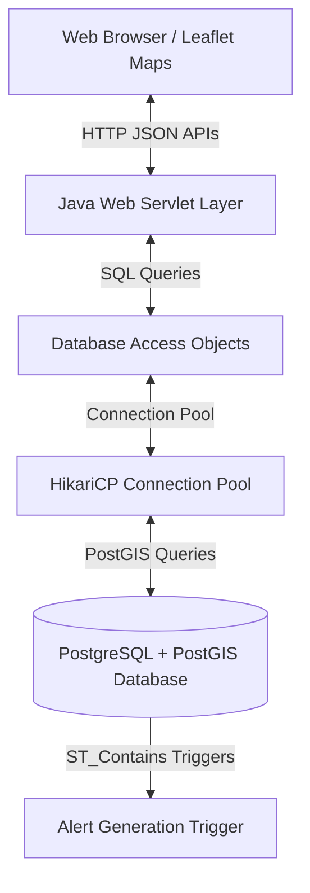

# Defence GIS Tracking System

[](#)
[](https://adoptium.net/temurin/releases/?version=17)
[](https://www.postgresql.org/)
[](https://postgis.net/)
[](https://tomcat.apache.org/)
[](LICENSE)

A production-grade, real-time spatial asset monitoring, alert generation, and geofencing management application designed for defence sector logistics and perimeter security. Built with PostgreSQL + PostGIS, Java Servlets, Apache Tomcat, and Leaflet.js maps.

---

## Architecture Overview



The system separates concerns across three tiers:
1. **Frontend (GIS Mapping Client):** Single Page Application using Leaflet for interactive rendering, custom layer overlays, historical route playback, and animated geofence visualisations.
2. **Backend (API Service Layer):** Java Web application serving REST endpoints, managing secure user sessions, and processing coordinate telemetry.
3. **Database (Spatial Engine):** PostgreSQL instance running PostGIS extensions. Handles spatial computations (polygon area, containment checks, route length calculation) directly in SQL.

---

## Features

- **Live Fleet Tracking:** Real-time updates of military vehicles, personnel, and drones on an OpenStreetMap interface.
- **Dynamic Geofencing:** Safe, warning, and restricted polygon creation with instant boundary breach alert generation.
- **Animated Map Highlights:** Fades unselected zones and pulses boundaries of active geofences during inspection.
- **Historical Route Playback:** Displays breadcrumb paths and calculates traveled distance and average speeds.
- **KPI Dashboards:** High-level charts, unacknowledged warning counters, and active asset statistics.
- **User management:** Multi-user logins with ADMIN credentials and security authorization filters.

---

## Technology Stack

| Component | Technology | Description |
| --- | --- | --- |
| **Frontend** | HTML5, Vanilla CSS, Vanilla JS | Sleek dark theme UI client with zero heavy framework bloat. |
| **Mapping Engine** | Leaflet.js | Open-source interactive map framework. |
| **Backend** | Java 17, Java Servlets, Maven | Core endpoint controllers. |
| **Connection Pool**| HikariCP | High-performance JDBC connection management. |
| **Serialization** | Google Gson | Fast JSON parsing and output. |
| **Authentication** | BCrypt | Standard salted password hashing. |
| **Database** | PostgreSQL 15+ & PostGIS 3+ | Relational data and spatial mapping functions. |

---

## Installation & Setup

For full installation guidelines, see the detailed [INSTALLATION.md](INSTALLATION.md).

### 1. Database Initialization
```bash
# Connect to PostgreSQL and execute the base schema seed script
psql -U postgres -f database/defence_gis.sql

# Run migration files sequentially
psql -U postgres -d defence_gis -f database/migrations/V002__schema_fixes_and_geofencing.sql
psql -U postgres -d defence_gis -f database/migrations/V003__bcrypt_passwords_and_seed_data.sql
psql -U postgres -d defence_gis -f database/migrations/V004__demo_data_expansion.sql
psql -U postgres -d defence_gis -f database/migrations/V005__add_missing_geofence_fields.sql
```

### 2. Configure Database Credentials
Create `backend/src/main/resources/db.properties` from template:
```properties
db.url=jdbc:postgresql://localhost:5432/defence_gis
db.username=postgres
db.password=YOUR_LOCAL_PASSWORD
```

### 3. Build & Run
```bash
# Compile and create the deployable WAR package
cd backend
mvn clean package

# Deploy to Tomcat by copying the target WAR to Tomcat webapps folder
copy target\DefenceGIS.war %CATALINA_HOME%\webapps\
```

Access the sign-in screen at:
`http://localhost:8080/DefenceGIS/pages/login.html`

---

## Default Credentials

The following accounts are pre-seeded in the database:

| Username | Password | Role | Description |
| --- | --- | --- | --- |
| **drdo** | `drdo2026` | ADMIN | Primary Administrator |
| **admin** | `admin123` | ADMIN | System Administrator |
| **mahendra** | `mahendra123` | ADMIN | Operations Administrator |

---

## Folder Structure
For complete folder documentation, see [PROJECT_STRUCTURE.md](PROJECT_STRUCTURE.md).

---

## REST API Endpoints
For detailed specifications of request/response objects, see [API_DOCUMENTATION.md](API_DOCUMENTATION.md).

---

## Database Schema
For tables, spatial indexes, and triggers reference, see [DATABASE_DOCUMENTATION.md](DATABASE_DOCUMENTATION.md).

---

## Future Enhancements
- **Websockets Integration:** Replace long polling with real-time WebSocket messaging for GPS coordinate feeds.
- **Kafka Telemetry Broker:** Integrate Apache Kafka to support high-throughput message processing from tens of thousands of active field devices.
- **Security Enhancements:** Add multi-factor authentication (MFA) and JWT-based request signatures.

---

## Contributing
Please read [CONTRIBUTING.md](CONTRIBUTING.md) for branch policies, commit style conventions, and reviews procedures.

---

## License
Distributed under the MIT License. See [LICENSE](LICENSE) for details.

---

## Author
Developed by the DRDO GIS Tracking System Team.
