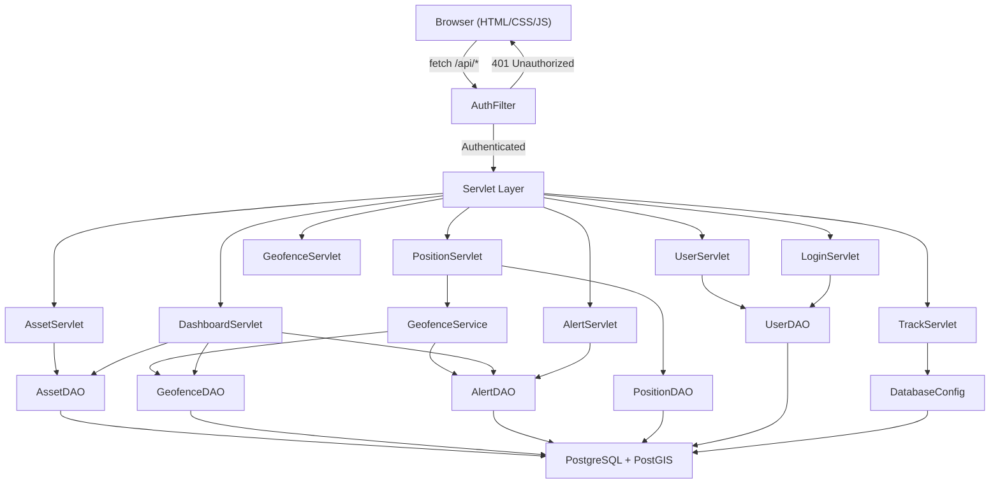
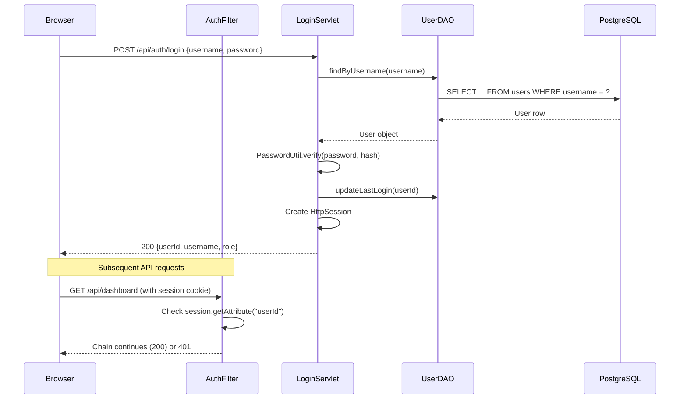
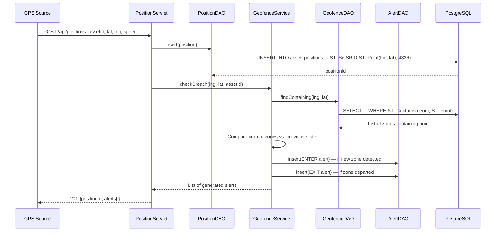

# System Architecture

This document describes the layered architecture, request lifecycle, and spatial data flow of the Defence GIS Tracking System.

---

## Architecture Overview

The system follows a classic **three-tier architecture** optimised for spatial data processing:

```
┌────────────────────────────────────────────────────────────────────┐
│                      CLIENT TIER (Browser)                        │
│  Leaflet.js Map  •  Dashboard UI  •  CRUD Pages  •  Auth Forms   │
└──────────────────────────┬─────────────────────────────────────────┘
                           │ HTTP / JSON
┌──────────────────────────▼─────────────────────────────────────────┐
│                    APPLICATION TIER (Tomcat)                       │
│  AuthFilter → Servlets → Services → DAOs                          │
│  LoginServlet  AssetServlet  PositionServlet  GeofenceServlet     │
│  AlertServlet  DashboardServlet  TrackServlet  UserServlet        │
└──────────────────────────┬─────────────────────────────────────────┘
                           │ JDBC / HikariCP
┌──────────────────────────▼─────────────────────────────────────────┐
│                      DATA TIER (PostgreSQL)                       │
│  PostGIS spatial functions  •  BCrypt password hashes             │
│  Tables: assets, asset_positions, geofence_zones, alerts,         │
│          track_history, users                                     │
└────────────────────────────────────────────────────────────────────┘
```

---

## Component Map



---

## Java Package Structure

```
com.drdo.gis
├── config/
│   └── DatabaseConfig        — HikariCP pool initialisation, db.properties loader
├── dao/
│   ├── AlertDAO              — CRUD for alerts table, acknowledge operations
│   ├── AssetDAO              — CRUD for assets table, count queries
│   ├── GeofenceDAO           — PostGIS ST_Contains queries, GeoJSON export
│   ├── PositionDAO           — GPS position insert with ST_Point, latest queries
│   ├── TrackDAO              — Track history lookup by asset
│   └── UserDAO               — User lookup by username, last login update
├── filter/
│   └── AuthFilter            — @WebFilter on /api/*, session-based gate
├── model/
│   ├── Alert                 — Breach alert with severity and acknowledgement
│   ├── Asset                 — Defence asset with type, code, status
│   ├── GeofenceZone          — Zone polygon metadata
│   ├── Position              — GPS coordinate with speed, heading, altitude
│   ├── TrackHistory          — Aggregated route summary record
│   └── User                  — Operator account with BCrypt hash
├── service/
│   └── GeofenceService       — ENTER/EXIT breach detection using PostGIS
├── servlet/
│   ├── AlertServlet          — GET alerts, PUT acknowledge
│   ├── AssetServlet          — Full CRUD for assets
│   ├── DashboardServlet      — Aggregated KPI counters
│   ├── GeofenceServlet       — GeoJSON zone export, zone detail by ID
│   ├── LoginServlet          — POST login/logout, GET session
│   ├── PositionServlet       — POST GPS ingest, GET latest positions
│   ├── TrackServlet          — GET route history as GeoJSON LineString
│   └── UserServlet           — GET user list
└── util/
    └── PasswordUtil          — BCrypt hash and verify
```

---

## Request Lifecycle

### Authentication Flow



### GPS Position Ingestion with Geofence Breach Detection



---

## Spatial Data Flow

All geometric operations are performed server-side inside PostgreSQL using PostGIS:

| Operation | PostGIS Function | Used By |
|-----------|-----------------|---------|
| Store GPS point | `ST_SetSRID(ST_Point(lng, lat), 4326)` | PositionDAO.insert |
| Extract coordinates | `ST_X(geom)`, `ST_Y(geom)` | PositionDAO.findLatest* |
| Containment test | `ST_Contains(zone.geom, point)` | GeofenceDAO.findContaining |
| Zone area calculation | `ST_Area(geom::geography)` | GeofenceDAO.findDetailsAsJson |
| Route line builder | `ST_MakeLine(geom ORDER BY recorded_at)` | TrackServlet |
| Route distance | `ST_Length(line::geography)` | TrackServlet |
| GeoJSON export | `ST_AsGeoJSON(geom)` | GeofenceDAO.findAllAsGeoJson |

---

## Security Layers

1. **AuthFilter** — All `/api/*` endpoints (except `/api/auth/login` and `/api/auth/session`) require a valid `HttpSession` with a `userId` attribute
2. **BCrypt Passwords** — User passwords stored as BCrypt hashes with cost factor 12
3. **Session Timeout** — Sessions expire after 30 minutes of inactivity
4. **No Password Leakage** — `UserServlet` strips `passwordHash` from API responses
